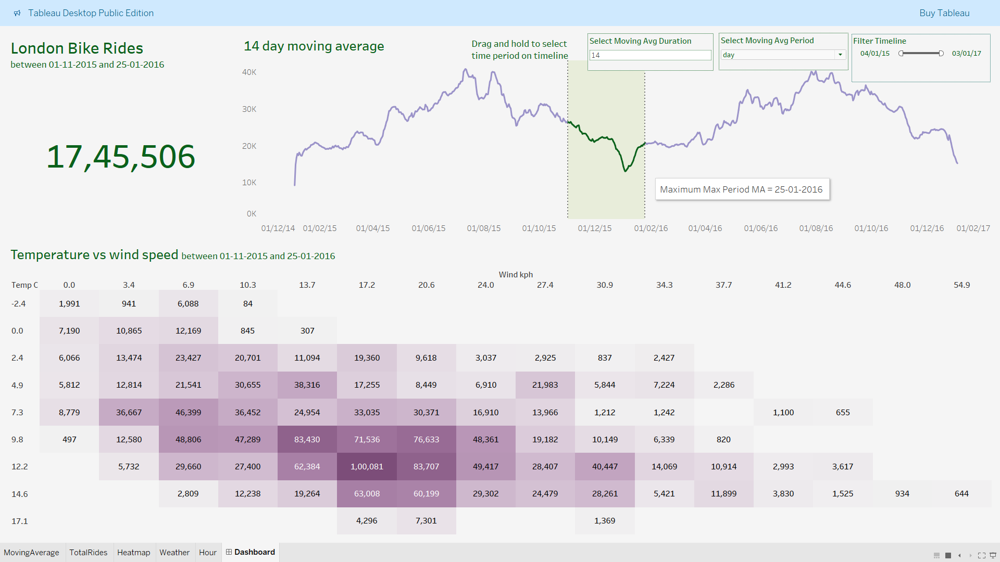
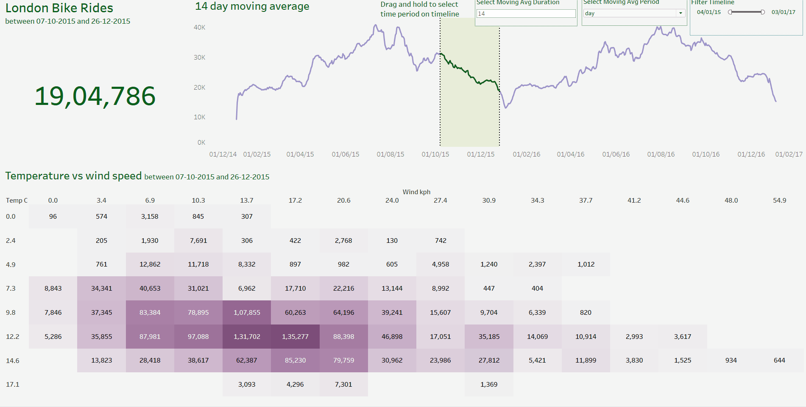

# 🚴‍♂️ London Bicycle Usage Analysis Dashboard

This project explores London bicycle hire data to uncover trends in ride volume, weather influence, and time-based patterns using a combination of Python and Tableau. The interactive dashboard provides tools to analyze moving averages, temperature vs wind speed impact, and date-based filtering.

---

## 📌 Objective

To analyze historical London bike ride data and deliver an interactive visual report that helps stakeholders understand seasonal usage trends and environmental factors affecting ride frequency.

---

## 🛠 Tools & Technologies

- **Python** (Pandas, NumPy) – Data cleaning & transformation
- **Tableau** – Interactive dashboard for visual analysis
- **Jupyter Notebook** – EDA and preprocessing
- **Git & GitHub** – Version control and documentation

---

## 📂 Project Structure

```bash
london-bicycle-analysis/
├── data/ # Raw CSV dataset
│ └── london_bike_data.csv
├── notebooks/ # Python data preprocessing
│ └── cleaning_and_eda.ipynb
├── tableau/ # Tableau dashboard file
│ └── london_bike_dashboard.twb
├── visuals/ # Screenshots of dashboard components
│ └── VIZ.png
├── README.md # Project documentation
└── .gitignore
```


---

## 📊 Key Dashboard Features

### ✅ Moving Average Trend
- Interactive **X-day moving average selector**
- Shows smoothed ride trends over time
- Highlights the date of **maximum moving average** ride volume

### ✅ Total Ride Count
- Displays the total number of rides within a selected date range

### ✅ Temperature vs Wind Speed Heatmap
- Matrix of ride counts grouped by temperature (°C) and wind speed (kph)
- Darker cells represent higher ride counts

### ✅ Slicers / Filters
- **Date range filter** (01-11-2015 to 25-01-2016)
- **Day type filter**: Weekday vs Weekend
- **Moving average window** selector (customizable duration)

---

## 🖼 Visuals



---

## 🎥 Dashboard Preview

Explore how ride trends shift with changing weather and time periods using this interactive Tableau dashboard.

- 🔁 Customize the **moving average window** (e.g., 14 days)
- 📅 Filter by **date range**
- 📊 Switch between **weekday/weekend usage**
- 🌡️ Understand ride patterns across **temperature vs wind speed**



---

## 🔍 Insights

- Usage peaks observed during moderate temperatures and low wind speeds
- Ride counts drop significantly in colder or windier conditions
- Weekday vs weekend usage patterns show distinct behaviors
- Interactive moving averages help identify trends over time

---

## 💡 Conclusion

The dashboard provides stakeholders a dynamic way to explore bicycle usage trends based on time and weather. It can help in infrastructure planning, demand forecasting, and marketing strategies based on seasonal behavior.

---

## 🧠 Author

**Gokula Krishnan**  
[LinkedIn](www.linkedin.com/in/gokula-krishnan-senthilkumar-70a824212) | [Portfolio](https://gokulkrish1045.github.io/goku1045/)  

---

